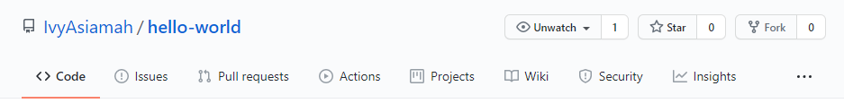

HEADER TAG
# This is h1 tag
## This is h2 tag
### This is h3 tag
#### This is h4 tag
#### This is h5 tag
##### This is h6 tag. The Last Header tag


  EMPHASIS
*This will make the italic*
_This also makes the text italic_

**This applies bold to the text**
__This also applies bold to text__

_You **combine** both italic and **bold**_


  UNORDERED LISTS
* Main Item 1
* Main Item 2
  * Sub Item 2a
  * Sub Item 2b
  
  
   ORDER LIST
1. Numbered Item 1
1. Numbered Item 2
1. Numbered Item 3
   1. Roman Number Item 3a
   1. Roman NumberItem 3b


 IMAGES
Here's an image of my GitHub:

Format: 


 LINKS
https://github.com/IvyAsiamah - automatic!
[IvyAsiamah](https://github.com/IvyAsiamah)


 BLOCKQUOTES
 
 As Bob Ross

> It's the imperfections that make something beautiful,
> that's what makes it different and unique from everything else.


I think you should use an
`<addr>` element here instead.

 INLINE CODE
 When `x = 3`, that means `x + 2 = 5`

  TASK LIST
- [x] @mentions, #refs, [links](), **formatting**, and <del>tags</del> supported
- [x] list syntax required (any unordered or ordered list supported)
- [x] this is a complete item
- [ ] this is an incomplete item


 TABLE MARKDOWN
 
 | Column 1       | Column 2     | Column 3     |
| :------------- | :----------: | -----------: |
|  Cell Contents | More Stuff   | And Again    |
| You Can Also   | Put Pipes In | Like this \| |


 SYNTAX HIGHLIGHTING
```csharp
private void index(){
  MessageBox.Show("hello world");
}
``` 


A repository to show all pending project and more.

Hi Everyone,

My Name is Ivy Asiamah, a computer science student from hubei university of technology.
My like programming in java, php and mysql.
I love to socialize. See you next time and have a good day.
Be Positive.

